# Tempus Usage Guide

[<- back home](README.md)

## Table of Contents
- [Prerequisites](#prerequisites)
    - [Verified backends](#verified-backends)
- [Getting Started](#getting-started)
    - [Installation](#installation)
    - [First Launch](#first-launch)
- [Server Configuration](#server-configuration)
    - [Initial Setup](#initial-setup)
    - [Home and away addresses](#home-and-away-addresses)
    - [Advanced editor (beta)](#advanced-editor-beta)
- [Main Features](#main-features)
    - [Library View](#library-view)
    - [Folder or index playback](#folder-or-index-playback)
    - [Now Playing Screen](#now-playing-screen)
    - [Podcasts](#podcasts)
    - [Radio Stations](#radio-stations)
    - [Downloads](#downloads)
    - [Continue listening](#continue-listening)
- [Navigation](#navigation)
    - [Bottom Navigation Bar](#bottom-navigation-bar)
- [Playing on another device](#playing-on-another-device)
- [Controlling another phone](#controlling-another-phone)
- [Favorites](#favorites)
    - [Favorites (aka heart aka star) to albums and artists](#favorites-aka-heart-aka-star-to-albums-and-artists)
- [Playlist Management](#playlist-management)
    - [Editing a playlist](#editing-a-playlist)
    - [Sorting playlists](#sorting-playlists)
- [Settings](#settings)
    - [Finding a setting](#finding-a-setting)
    - [Language](#language)
    - [Appearance](#appearance)
    - [Sound](#sound)
    - [Buffering and cache](#buffering-and-cache)
    - [Scrobbling](#scrobbling)
- [Android Auto](#android-auto)
    - [Enabling on your head unit](#enabling-on-your-head-unit)
    - [Tabs](#tabs)
    - [Bundles](#bundles)
    - [Thumbnails or lists](#thumbnails-or-lists)
    - [Artists and Instant Mix](#artists-and-instant-mix)
    - [A-Z and search](#a-z-and-search)
    - [Shortcuts](#shortcuts)
- [Known Issues](#known-issues)
    - [Airsonic Distorted Playback](#airsonic-distorted-playback)
    - [Support](#support)

## Prerequisites

**Important Notice**: This app is a Subsonic-compatible client and does not provide any music content itself. To use this application, you must have:

- An active Subsonic API server (or compatible service) already set up
- Valid login credentials for your Subsonic server
- Music content uploaded and organized on your server

Tempus offers advanced features such as Instant Mix, Continuous Play, Artists Page, and many others, which require a properly configured server capable to respond to "similar songs" requests and correctly tagged music files.

### Verified backends
This app works with any service that implements the Subsonic API, including:
- [LMS - Lightweight Music Server](https://github.com/epoupon/lms) -  *personal fave and my backend*
- [Navidrome](https://www.navidrome.org/)
- [Gonic](https://github.com/sentriz/gonic)
- [Ampache](https://github.com/ampache/ampache)
- [NextCloud Music](https://apps.nextcloud.com/apps/music)
- [Airsonic Advanced](https://github.com/kagemomiji/airsonic-advanced)

[Back to top](#table-of-contents)

## Getting Started

### Installation
1. Download the APK from the [Releases](https://github.com/eddyizm/tempus/releases) section
2. Enable "Install from unknown sources" in your Android settings
3. Install the application

### First Launch
1. Open the application
2. You will be prompted to configure your server connection
3. Grant necessary permissions for media playback and background operation

[Back to top](#table-of-contents)

## Server Configuration

### Initial Setup

The first screen lists your servers. Tap **+** to add one:

    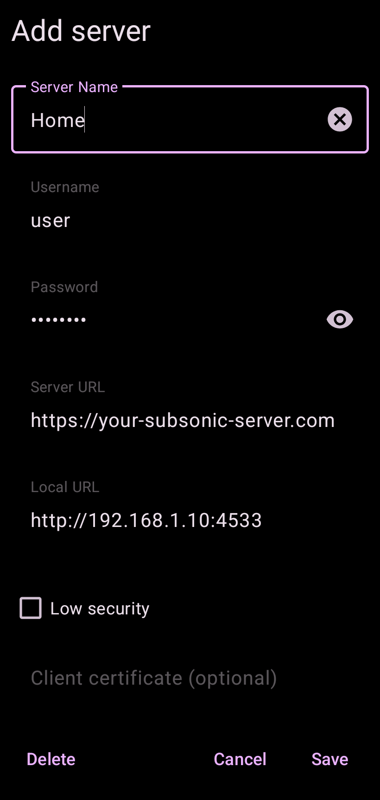

1. **Server Name** is any name you like.
2. **Username** and **Password** are your login for that server. Or in some cases, API key (eg LMS: https://github.com/epoupon/lms/discussions/562).
3. **Server URL** is your server's address, starting with `http://` or `https://`, for example `https://your-subsonic-server.com`.
4. **Local URL** is optional, see [Home and away addresses](#home-and-away-addresses).
5. **Low security** sends your password with every request instead of a token. Turn it on only if your server does not accept token login.
6. **Client certificate** is optional. Tap the field to pick a certificate installed on the phone, for servers that ask for one.

Tap **Save**, then tap the server in the list to log in. If the login fails, Tempus shows the error and you stay on the list.

Long press a server to edit it. The password field opens empty, so type the password again before you tap **Save**. To delete the server, long press **Delete**.

To switch servers, go to **Settings → General → Log out**, which takes you back to this list.

If you intend to play to a TV or a network speaker, the address you enter here also has to be reachable from that device, because it fetches the music from your server itself. See [Playing on another device](#playing-on-another-device).

### Home and away addresses

With a Local URL set, Tempus uses it when it answers and the Server URL otherwise. Each time the app comes to the front while on the Server URL, it tests the Local URL and moves to it only if it answers. If the Local URL stops answering, the app moves back to the Server URL. This suits a server you reach by its home network address at home and by a public or VPN address everywhere else.

When neither address answers, Tempus shows **Server unreachable**. **Continue anyway** hides it for 24 hours, and **Go to login** logs you out and returns to the server list.

### Advanced editor (beta)

**Advanced editor (beta)** on the server list opens a newer screen for the same servers. Pick a server at the top, or **Add new server**, fill in the fields and tap **Create** or **Update**. **Test** checks the saved server's connection. To log in, go back and tap the server in the list.

Long press the Tempus icon and pick **Introduction** to open the welcome, permissions, themes and server pages on their own. If the app crashes at start, you can fix or delete a server there.

[Back to top](#table-of-contents)

## Main Features

### Library View

**Multi-library**

Tempus handles multi-library setups gracefully. They are displayed as Library folders. 

If your server reports more than one music folder, Tempus can limit browsing and search to a single one of them.

Tap the app name in the toolbar on the Music tab of Home, or on Library. A second line under it names the library in use, and tapping opens a checked list of the server's libraries. The same setting lives in Settings under General as "Music library". Either one takes effect on the screen you are looking at, with no restart and no navigating away.

    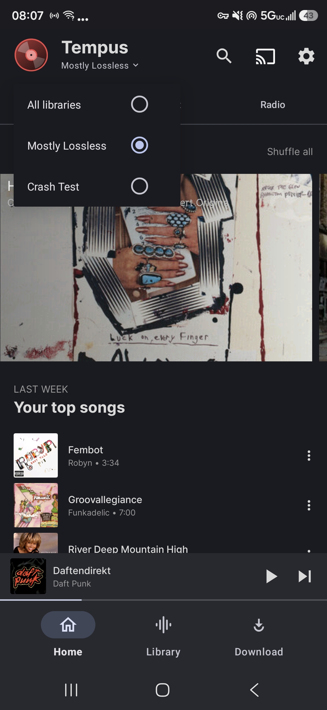

"All libraries" is the default and keeps the old merged view. The filter reaches browsing and search only, so it never touches your starred items, your playlists or your downloads. On the Podcast and Radio tabs that second line names your server instead of a library, and it is not tappable there. On Downloads there is no second line at all.

    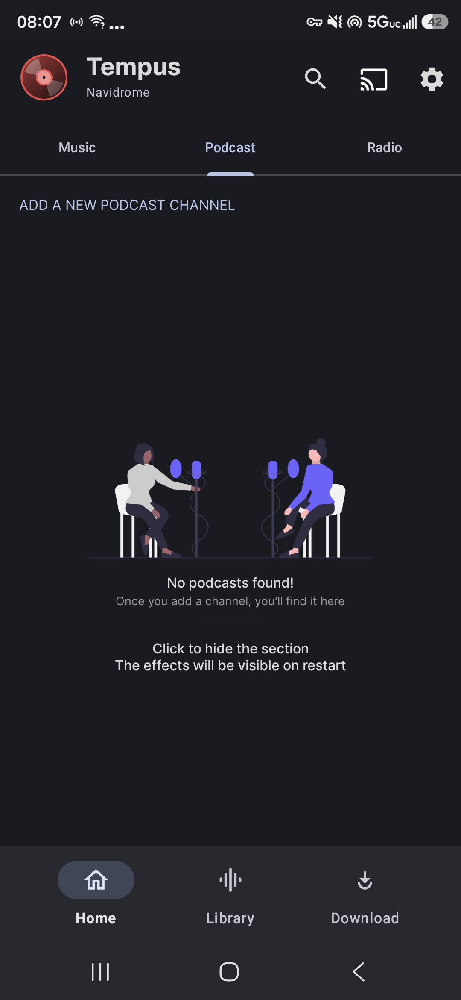

The setting is hidden when there is only one library to choose from.

### Folder or index playback

If your Subsonic-compatible server exposes the folder tree **or** provides an artist index (for example Gonic, Navidrome, or any backend with folder browsing enabled), Tempus lets you play an entire folder from anywhere in the library hierarchy:

    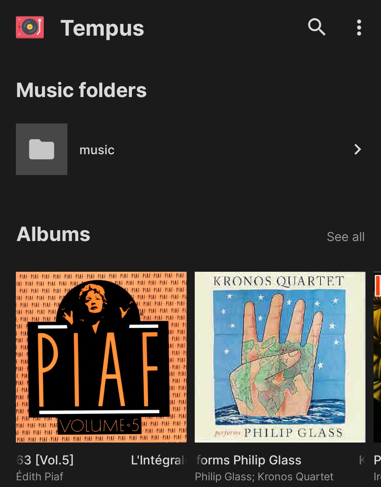
    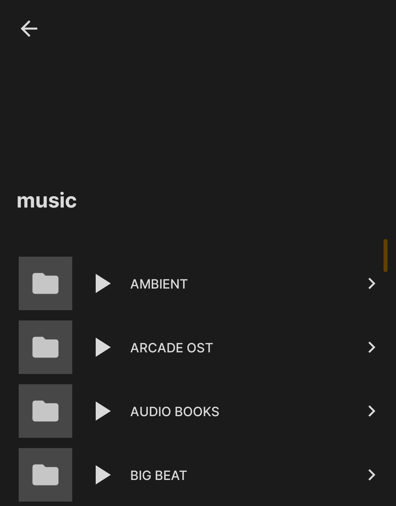

- The **Library ▸ Music folders** screen shows each top-level folder with a play icon only after you drill into it. The root entry remains a simple navigator.
- When viewing **inner folders** **or artist index entries**, tap the new play button to immediately enqueue every audio track inside that folder/index and all nested subfolders.
- Video files are excluded automatically, so only playable audio ends up in the queue.

No extra config is needed—Tempus adjusts based on the connected backend.

### Now Playing Screen

Swipe the artwork left or right to play the next or previous track in the queue. Radio stations have one cover and do not swipe.

Tap the artwork to show four buttons over it, and tap again to hide them.

    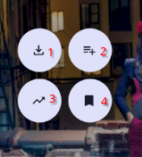

*marked the icons with numbers for clarity* 

1. Downloads the track.
2. Adds the track to a playlist.
3. Adds this track again, followed by songs similar to it, right after the current track (Instant Mix). It uses [getSimilarSongs](https://opensubsonic.netlify.app/docs/endpoints/getsimilarsongs/) of the OpenSubsonic API, so which songs you get depends on your server. For example, Navidrome gets 15 similar artists from Last.fm, then 20 top songs from each.
4. With **Sync play queue for this user** turned on under Settings → Miscellaneous, saves the play queue. With it off, this button opens the lyrics instead.

Below the playback controls is a row of three buttons.

- **Sleep timer** stops playback after 5 to 60 minutes, after a number of minutes you type in, or at the end of the current track. The volume fades out before playback pauses. While a timer is set, the time left shows under the button, and tapping it again lets you cancel.
- **Lyrics** slides over to the lyrics. Tap it again or swipe back to return.
- **Queue** opens the queue.

Long press the format label above the artwork, "flac" for example, to hide this row, and long press it again to bring it back. A short tap on the label shows or hides the bitrate.

Tap the title to open its album, or the artist to open the artist. Long press either one to copy it.

To show the track number in front of the title, turn on **Show track number** under **Settings → UI**.

The ⋮ menu next to the heart has **Play on…** and **Add to playlist**, plus **Built-in equalizer** when Built-in is picked under Settings → Sound. Tablets do not have this menu.

**Format and bitrate**

The player's format and bitrate label gives what was actually decoded, not the transcode Tempus asked for. If your server ignored the request, or had no rule matching the track, the label shows what it really sent. A track the server did transcode reads as the new format followed by "(Transcoding)".

Downloaded tracks show the format on disk. When Tempus transcodes a download, the row and the track info dialog carry the transcoded format and bitrate instead of the source values.

### Podcasts  
If your server supports it - add a podcast rss feed

    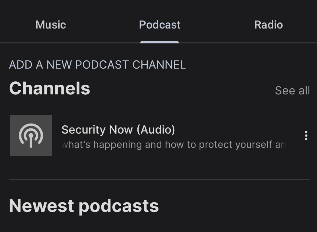

### Radio Stations

The Radio tab on Home lists your stations by name. Tap one to play it.

    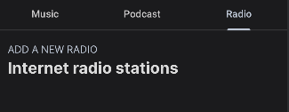

Tap **Add a new radio** to add a station. Type the name and stream address yourself, or tap the search icon next to the name to look the station up by name, country or both. The search uses [radio-browser.info](https://www.radio-browser.info/), a public directory, not your server. It lists up to 30 stations, the most voted first, and **Use** fills in the fields for you.

Under **Save to**, pick where the station is kept.

- **Server** saves it on your server, if your server supports radio stations. If saving fails, the dialog stays open so you can switch to **Local**.
- **Local** keeps it on the phone, marked **LOCAL** in the list. A local station can also have a cover image, which Tempus downloads and keeps on the phone. Local stations show up with every server you log into.

Long press a station, or tap its ⋮, to edit or delete it. A saved station cannot be moved between Server and Local.

### Downloads

The Download tab lists every track stored on the phone. Tap the filter button at the top right to list them by Track, Album, Artist, Genre, Playlist or Year. Tempus remembers the choice.

The Track and Album lists are sorted by album artist, then album, then disc and track number, so a compilation with a different artist on each track stays together in track order and is listed under its album artist. An album whose server reports no album artist sorts under its own title.

**Playlist** lists the tracks you downloaded from a playlist, under the playlist's name. Each download remembers one playlist only, so a track that is in two playlists, or was downloaded from an album first, may not show under the playlist you expect.

**Keeping a playlist downloaded**

In a playlist's ⋮ menu, turn on **Keep synced**. Tempus downloads every track of the playlist that is not on the phone yet, then checks again each time you open the playlist and once each time the app starts, and downloads any track added since. Tracks removed from the playlist stay downloaded. There is no check while Tempus is closed.

**Download only on Wi-Fi**, under Settings → Data, pauses downloads on mobile data and resumes them on Wi-Fi. It does not apply when downloads are saved to a folder you picked.

### Continue listening

When you open Tempus again, your queue comes back with the track you were on, paused where you stopped.

Podcast episodes, audiobooks and music tracks longer than 10 minutes also keep their spot after you move on to something else. Tempus saves it when you pause, when you switch tracks, and every 15 seconds while playing. These tracks are listed under **Continue listening** on the Music tab of Home, newest first, each with its cover, title, album and the time it resumes at. Tap one to play it from that spot, with the rest of its album after it. The row is hidden while it is empty.

The spot is also saved as a bookmark on your server, if the server supports bookmarks, so the row also shows tracks you stopped on another device with the same account, and bookmarks made by other apps. A track leaves the row when it plays through to the next one.

[Back to top](#table-of-contents)

## Navigation

### Bottom Navigation Bar
- **Home**: Recently played and server recommendations
- **Library**: Your server's complete music collection
- **Download**: Locally downloaded files from server 

[Back to top](#table-of-contents)

## Playing on another device

Tempus can hand playback to a UPnP or DLNA renderer on your network, such as a TV, an AV receiver or a network speaker. Tap the cast button in the toolbar, pick the device, and the queue, the position and the play state move to it while the app keeps the controls. On the GitHub build the same button lists Chromecast devices and network renderers together. On the degoogled build the button shows a speaker icon, not the Cast icon.

    
    

The renderer fetches the music from your server itself. Nothing is streamed through the phone, which is how the protocol works. Downloaded tracks are played from your server too, because the renderer cannot reach what is stored on the phone.

**Your server address has to be one the renderer can reach.** If Tempus is configured with an address only the phone can use, the device still appears in the list and still accepts being selected, and then plays nothing. Addresses that fail this way:

- a VPN or mesh network address, a Tailscale or WireGuard address for example, when the renderer is not on that network
- `localhost` or `127.0.0.1`
- an address on a different subnet from the renderer, which is easy to end up with when there is a second router

Use the address your server has on the same network as the renderer.

Volume is left to the renderer's own remote, because some renderers report a volume that does not match what they are doing. The sleep timer's fade out has no effect on a renderer, so playback stops at full volume when the timer runs out. Discovery uses SSDP, which is UDP and lossy, so if your device does not appear the first time, close the picker and open it again.

[Back to top](#table-of-contents)

## Controlling another phone

This feature is experimental. Two phones running Tempus can pair over your local network, so one phone, the controller, picks the music and runs playback on the other, the receiver. Both phones need a Tempus version with this feature and have to use the same server address, because the receiver plays every track from your server with its own account. Songs downloaded on the controller still need the server on the receiver.

**Pairing**

Open **Settings → Remote player**. Set the phone's name under **This device**. One phone can be both a receiver and a controller.

1. On the phone that will play the music, turn on **Allow control from the local network** under **Receiver**. Tempus then shows a notification while the receiver runs.
2. On the receiver, turn on **Make available for pairing**. This opens pairing for two minutes.
3. On the controller, tap **Find devices** and select the receiver.
4. Both phones show a code. If the codes match, confirm on the receiver first, then on the controller.

A paired controller does not need pairing opened again. To remove one, tap it under **Paired controllers** on the receiver and confirm.

**Playing on the receiver**

Tap the device icon on the mini player, or **Play on…** in the expanded player or its overflow menu, and pick the receiver. The normal player then shows **Playing on** and the receiver's name, and its playback controls, shuffle, repeat, speed, seeking from the lyrics and the sleep timer all act on the receiver. The volume keys change the receiver's volume. With the screen off or Tempus in the background, that works only while Android keeps Tempus running and sends the keys to it. Audio effects are set on the receiver itself.

While a receiver is selected, **Play**, **Add to queue** and **Play next** in the library send music to it, albums and playlists included. Adding to an empty receiver queue loads it without starting playback. **Queue** shows the receiver's queue, where you can tap to play or pause, swipe to remove, drag to reorder, and use the menu to shuffle or clear the upcoming tracks, or save the whole queue as a playlist. The controller's own queue is left as it was.

Tap the device button again to go back. The receiver keeps playing, and the controller does not start playing on its own.

**Limits**

- Music only, up to 500 tracks, repeats included. Radio and podcasts are not supported.
- The selection survives rotating the phone but not Tempus being closed. If the receiver restarts or changes address, release it and select it again.
- A failed command never falls back to playing on the controller.
- Guest networks may block discovery. Found receivers drop off the list after 45 seconds and the search starts again. Tap **Find devices** to search at any time.
- When a found phone cannot connect, the message on screen says at which step it failed. Include that message in a report.

Connections use mutual TLS, and each phone is approved by hand. There is no unencrypted fallback.

[Back to top](#table-of-contents)

## Favorites

### Favorites (aka heart aka star) to albums and artists
- Long pressing on an album gives you access to heart/unheart an album   

    

- Long pressing on an artist cover gets you the same access to to heart/unheart an album   

    

[Back to top](#table-of-contents)

## Playlist Management

### Editing a playlist

Open a playlist and pick Edit playlist from its menu to rename it, drag tracks into a new order, or remove tracks. Saving writes the list exactly as it stands on screen, so a removal or a reorder takes effect on the server instead of being added on top of the tracks already there.

Two things to know:
- A playlist has to keep at least one track. A save that would leave it empty is refused and the editor says so, use Delete if you want the playlist gone.
- Saving needs the server. The editor will not save from the offline cache, because writing that older copy back would drop anything added to the playlist since it was cached.

### Sorting playlists

Open the full playlist list with **See all** next to Playlists on Home or Library, and tap the sort button to change the order. The same choice is under **Settings → Playlist → Playlist sorting**. It also orders the Playlists row on Home, which shows up to 20 playlists, and the list you pick from when you add songs to a playlist. Tempus remembers it.

- **Name** sorts A to Z. This is the default.
- **Random** shuffles the list.
- **Date Created** puts the newest playlist first.
- **Song Count** puts the playlist with the most songs first.
- **Faves** puts your faves first.
- **Last played** puts the playlist you opened most recently first.
- **Last updated** puts the playlist changed on the server most recently first.
- **Recently active** uses whichever is newer, when you last opened it or when it last changed.

**Faves**

To make a playlist a fave, tap **Add to faves** in its ⋮ menu, or long press it in the playlist list. Tap **Remove from faves** to undo it. Faves are kept on the phone, not on your server, and a playlist deleted from the server stops being a fave.

[Back to top](#table-of-contents)

## Settings

### Finding a setting

Tap the search icon at the top of Settings and type part of a setting's name or description. Only the matching settings stay on screen, each under its page. Capital letters and accents are ignored, and a match on a page name, such as **Sound**, shows that whole page. The options on the Theme screen are not searched, so search for **Theme** to find that screen.

### Language

Select **Settings → UI → Language** to choose an app language. Swedish is available as **Swedish** (or **Svenska**, depending on the current language). Select **System language** to follow your device language.

### Appearance

Open **Settings → UI → Theme** to change how Tempus looks. Each change applies right away.

- **Theme** is Light, Dark or System default, which follows the phone.
- **True black background for dark mode** makes the backgrounds pure black while Tempus is dark. It does nothing in Light.
- **Dynamic color accent from wallpaper** takes the app's colors from your wallpaper. It is on by default.
- **Choose Accent Color** builds the app's colors from one color instead. Turn off the wallpaper switch first, or your choice is saved but the wallpaper colors stay. Tap a color to use it. The first one opens a picker where you choose any color.

Accent colors, from the wallpaper or picked, need Android 12 or newer, and some phones on Android 12 do not support them. Without them Tempus keeps its default colors.

**Tiles size**, under **Settings → UI**, sets how big album and artist covers are in grids and rows, and the Discover cards on Home. **Default** is the largest and **Tiny** the smallest.

**Rounded corners** rounds the corners of covers and **Corners size** sets how much. Restart Tempus after changing either.

### Sound

**Settings → Sound** holds the equalizer, ReplayGain and volume settings.

**Select an equalizer to use** picks one of three:

- **Default** adds no equalizer.
- **Built-in** uses the equalizer in Android itself. Open it from **Built-in equalizer** below the choice, or from the ⋮ menu on the Now Playing screen, turn on **Enable** and set each band. How many bands you get depends on the phone. **Reset** puts every band back to 0 dB.
- **External** lets an equalizer app on the phone work on Tempus. **System equalizer** below the choice opens that app, and shows only when the phone has one.

**Set replay gain mode** evens out the volume between tracks. It is off by default.

- **Track** plays every track at about the same loudness.
- **Album** keeps the differences between tracks of an album and evens out albums. A track with no album value uses its track value.
- **Auto** uses the album value when the track before it is from the same album, and the track value otherwise.

Tempus takes the values from your server and, if the server sends none, from the file's tags. **Prevent clipping**, on by default, lowers the gain when the file's peak value shows the track would clip. It works only while ReplayGain is on.

**Pre-amplification** makes everything Tempus plays louder or quieter, by up to 15 dB, with ReplayGain on or off. A change is heard from the next track.

### Buffering and cache

These are under **Settings → Data**.

**Song preload buffer** sets how much music ahead of where you are Tempus downloads while streaming, 1 minute by default. Restart Tempus after changing it.

**Size of streaming cache** keeps the music you stream on the phone, so playing it again does not download it again. It is 256 MiB by default, and when it is full the music you played longest ago is removed first. The setting shows how much of it is in use. A new size takes effect after Tempus restarts, and **Disabled** turns the cache off.

**Pre-cache upcoming tracks** downloads the next 1, 2, 3 or 5 tracks of the queue into the streaming cache, so skipping to them starts at once and short signal drops do not stop playback. It follows shuffle and repeat, leaves out radio and downloaded tracks, and does nothing while the streaming cache is **Disabled**. **Pre-cache on Wi-Fi only**, on by default, pauses it on mobile data.

### Scrobbling

**Enable music scrobbling**, under **Settings → Miscellaneous**, is on by default. It tells your server what you are playing and which tracks you played. Tempus sends this only to your server, which may pass it on to a service such as Last.fm if it is set up to.

A track counts as played when it plays to the end. When you skip to another track in the queue, the one you left counts if it played past its halfway point or 4 minutes, whichever comes first, unless it is 30 seconds or shorter. Only music counts, not podcasts or radio. A play that does not reach the server is not sent again later.

[Back to top](#table-of-contents)

## Android Auto

Android Auto needs the `app-tempus` build from the GitHub releases. The degoogled build, `app-degoogled` and the version on F-Droid and IzzyOnDroid, does not offer your library to Android Auto, and its Settings has no Android Auto page.

### Enabling on your head unit

To allow the Tempus app on your car's head unit, "Unknown sources" needs to be enabled in the Android Auto "Developer settings". This is because Tempus isn't installed through Play Store. Note that the Android Auto developer settings are different from the global Android "Developer options".
1. Switch to developer mode in the Android Auto settings by tapping ten times on the "Version" item at the bottom, followed by giving your permission.

   
   
   

2. Go to the "Developer settings" by the menu at the top right.

   

3. Scroll down to the bottom and check "Unknown sources".

   

### Tabs

The Android Auto interface can be configured by the user to best suit their preferences. The settings are under **Settings → Android Auto**.

    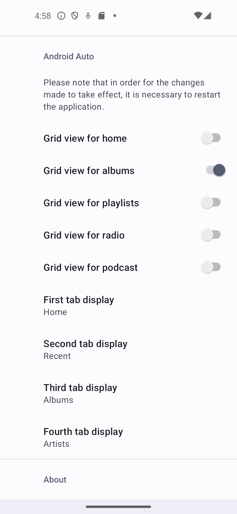
    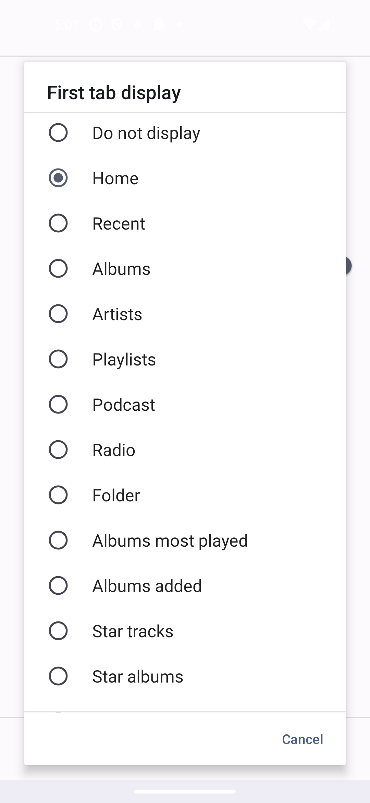

4 tabs can be configured with the following functions:

| Function | What it shows |
|---|---|
| Do not display | This tab is not used |
| Home | Displays all functions not used in other tabs |
| Recent | The 15 recently listened-to albums |
| Albums | Albums sorted by name |
| Artists | Albums sorted by artist or Artists, selected by preference |
| Playlists | |
| Podcast | The 100 podcasts recently added |
| Radio | Your server's stations together with any you added locally in the app. The local ones show even when the server reports no stations of its own |
| Folder | Navigation through music directories |
| Albums most played | The 15 most played albums |
| Tracks played | The 100 last tracks that were completely played |
| Albums added | The 15 recently added albums |
| For You bundle | |
| Starred bundle | |
| Tracks bundle | |
| Genres | 500 songs of the chosen genre OR 100 random songs if "shuffle genre songs" is selected |
| Downloads | the 500 first downloaded tracks OR 100 random downloaded tracks if "shuffle downloaded tracks" is selected. Shown at the top of the Home tab and playable without connectivity |

If all tabs are set to "Do not display", then "Home" tab will be created with all functions inside.

If "Home" is selected after another tab, it becomes "More".

### Bundles

For You bundle includes:

| Item | What it shows |
|---|---|
| Quick mix | features 12 tracks chosen randomly from the 15 last played albums |
| My mix | features 15 tracks chosen randomly from the 15 last played albums, and starred artists or starred albums, following preference |
| Discovery mix | features 18 tracks, as My mix, with similar songs |
| Starred artists | |
| Starred albums | |
| Starred tracks | the 500 first starred tracks OR 100 random starred tracks if "shuffle starred tracks" is selected |

Starred bundle includes:

| Item | What it shows |
|---|---|
| Starred artists | |
| Starred albums | |
| Starred tracks | the 500 first starred tracks OR 100 random starred tracks if "shuffle starred tracks" is selected |

Tracks bundle includes:

| Item | What it shows |
|---|---|
| Random | 100 random songs |
| Genres | 500 songs of the chosen genre OR 100 random songs if "shuffle genre songs" is selected |
| Tracks played | The 100 recently listened-to tracks |
| Starred tracks | the 500 first starred tracks OR 100 random starred tracks if "shuffle starred tracks" is selected |

    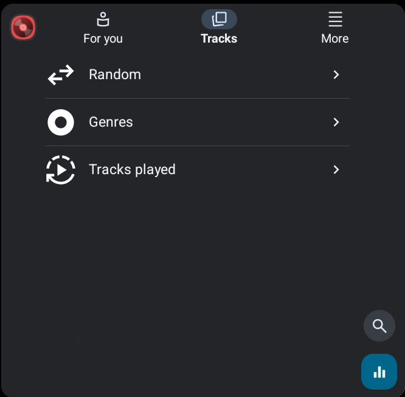
    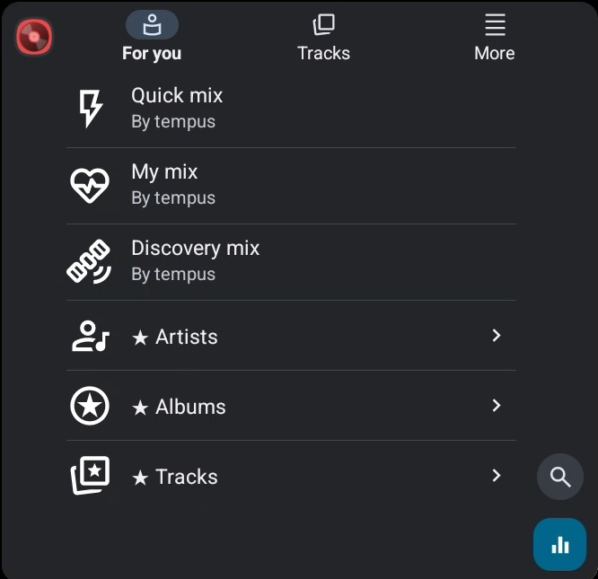

### Thumbnails or lists

    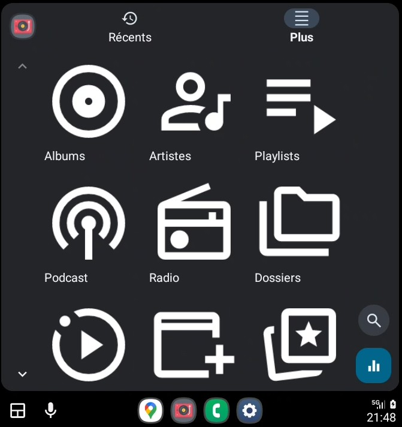
    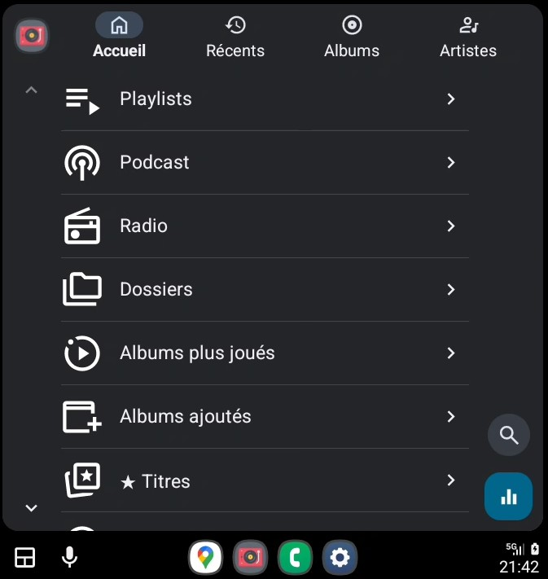

In addition, you can choose to display the following functions as thumbnails or lists:
- Home, For You bundle, Starred bundle and Tracks bundle
- Albums (Last played, Most played, Recently added, Artists, Starred albums, Starred artists)
- Playlists
- Radio
- Podcast

As they displayed tracks, Tracks played, Starred tracks, Random and Genres are always displayed as a list.

### Artists and Instant Mix

Artists view and View by albums:

    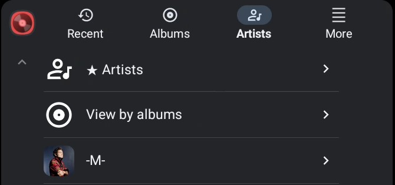
    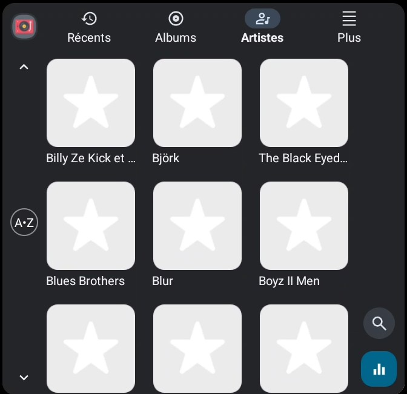

Starred Artists view:

    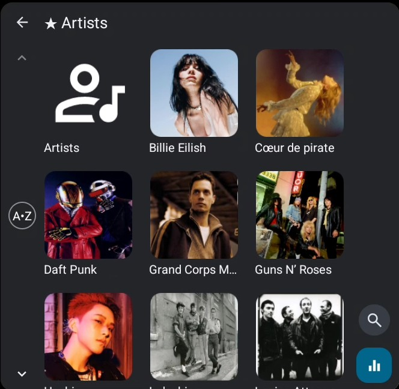

On an artist's page, if they have at least 2 albums with a minimum of 20 tracks, an "Instant Mix by Tempus" album is added at the beginning.
This album features 12, 15 or 18 tracks chosen randomly from their discography and is one click play.
The number of tracks on the album depends on the size of the artist's discography (>20, >30 or >40)

    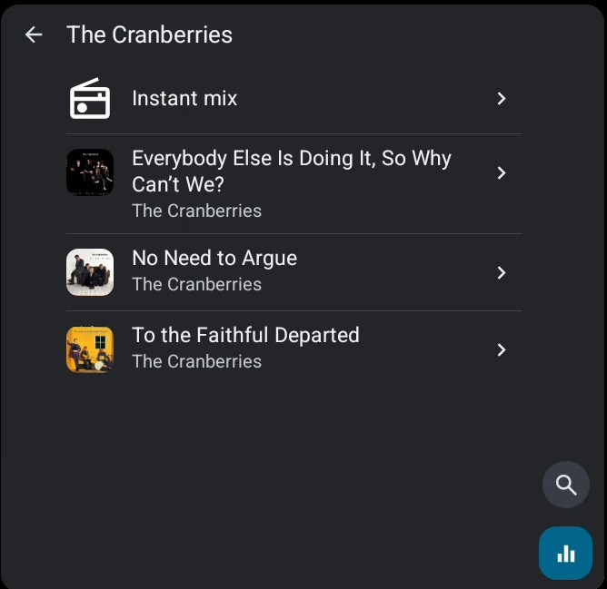

When an album has tracks on more than one disc, its track list is grouped under a heading for each disc, such as **Disc 1**, with the disc's title after the number when your server sends one.

### A-Z and search

The A-Z button allows you to jump to items starting with the chosen letter.

Search button returns albums or artists, even if they are not displayed by the selected function.

Results of the A-Z jump will always be displayed as a list.

    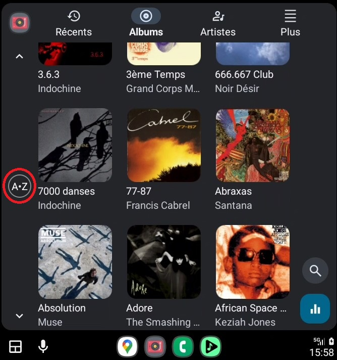
    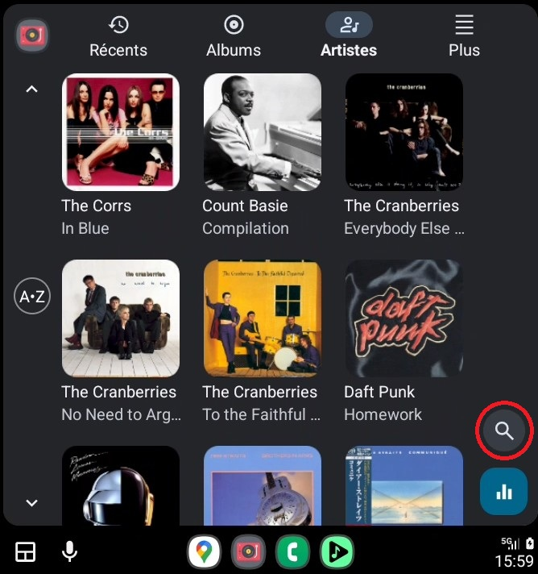

Display of albums and artists is limited to 500. For large libraries, it's preferable to use star albums or star artists.

### Shortcuts

Shortcuts are displayed only if the function is selected from root level:
- On albums page: jump to starred albums
- On starred albums page: jump to albums
- On artists page: jump to starred artists
- On starred artists page: jump to artists

[Back to top](#table-of-contents)

## Known Issues

### Airsonic Distorted Playback

First reported in issue [#226](https://github.com/eddyizm/tempus/issues/226)  
The work around is to disable the cache in the settings, (set to 0), and if needed, cleaning the (Android) cache fixes the problem.

### Support
For additional help:
- Question? Start a [Discussion](https://github.com/eddyizm/tempus/discussions)
- Open an [issue](https://github.com/eddyizm/tempus/issues) if you don't find a discussion solving your issue. 
- Consult your Subsonic server's documentation

---

*Note: This app requires a pre-existing Subsonic-compatible server with music content.*

[Back to top](#table-of-contents)
